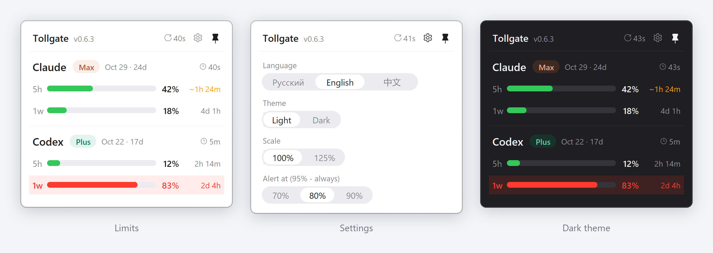

<p align="center">
  
</p>

<h1 align="center">Tollgate</h1>

<p align="center">
  <a href="README.md"></a>
  <a href="README.ru.md"></a>
</p>

<p align="center"><em>"Limits run out at the worst moment - in the middle of a task. Tollgate keeps them in sight: a toll gate between you and AI that shows what you have spent and warns you before it is gone. Next it learns to spend less and to keep secrets out."</em></p>

<p align="center">
  <a href="CHANGELOG.md"></a>
  <a href="https://github.com/sergvss/tollgate/actions/workflows/tests.yml"></a>
  <a href="LICENSE"></a>
  
  
  
  
  
</p>

<p align="center">
  <a href="#why">Why</a> ·
  <a href="#quick-start">Quick start</a> ·
  <a href="#what-you-get">What you get</a> ·
  <a href="#controls">Controls</a> ·
  <a href="#where-the-data-comes-from">Data sources</a> ·
  <a href="#what-tollgate-never-does">Never does</a> ·
  <a href="#updating-and-uninstalling">Updating</a> ·
  <a href="#limitations">Limitations</a> ·
  <a href="#roadmap">Roadmap</a> ·
  <a href="#development">Development</a>
</p>

---

A Windows tray icon (next to the clock) with a pop-up panel showing your **Claude Code** and **Codex** (ChatGPT) subscription limits: how much of each window (5 hours, day, week) is used, when it resets, your plan and when the subscription ends. When a limit is running low, Tollgate sends a notification and highlights the window that is about to run out - and if you are burning through it fast, it tells you in advance how long you have left.

<p align="center">
  
</p>

> **Language.** The app speaks English, Russian and Chinese (switch in settings). This README is in English; the developer docs - [PROJECT_MAP](PROJECT_MAP.md), [TODO](TODO.md), [CHANGELOG](CHANGELOG.md) - are in Russian.

---

## Why

| Situation | What Tollgate gives you |
|---|---|
| The Claude 5-hour limit ran out mid-task, with no warning | A one-line alert at your threshold (70/80/90%) and always at 95% - shown even in Do Not Disturb - plus a forecast: "at this pace it runs out in ~40m" |
| You use both Claude Code and Codex and lose track of which one has room left | Both providers in one panel, every limit window: 5h, 1d, 1w |
| You work in the desktop app or an IDE, and the limits in the status line never refresh | Auto-refresh every 5 minutes, wherever you work |
| You forgot when the subscription renews | Plan badge, end date and days left; a reminder 3 days before |
| You do not want a tool that sends your data anywhere or reads your tokens | Local files only; login tokens are never read |

---

## Quick start

| | What to do |
|---|---|
| 1 | Windows 10/11 and [Python 3.10+](https://www.python.org/downloads/) - tick **Add python.exe to PATH** during installation |
| 2 | `git clone https://github.com/sergvss/tollgate.git` |
| 3 | `cd tollgate` and run `install.bat` |
| 4 | Find the two-bar icon next to the clock and left-click it |
| 5 | Check without the UI: `python -X utf8 tollgate.py --print` - it should print the limits of both providers |

Cannot see the icon? It is hidden under the "^" arrow in the tray: drag it onto the taskbar, or enable it in Settings → Personalization → Taskbar → Other system tray icons.

**What `install.bat` does:**

1. Installs the dependencies (`pystray`, `pillow`).
2. Registers the Claude Code status line (`statusline.py`) in `~/.claude/settings.json`, so that in the terminal Claude limits refresh after every reply. If you already have a status line of your own, it is left untouched. A backup `settings.json.bak-tollgate` is saved before the edit.
3. Puts a `Tollgate.lnk` shortcut into Startup and launches the widget. Running it again does not start a second copy.

---

## What you get

- **Limits of both providers** - Claude Code (5h, week) and Codex (ChatGPT subscription windows): percentage, bar, time to reset and how fresh the data is.
- **Forecast** - if at the current pace a limit runs out before it resets, the reset time is replaced with how long you have left (`~40m`), in amber. The pace is measured over the last hour of work.
- **Alerts** - at the threshold you choose (70%, 80% or 90%; 80% by default) and always at 95%, a one-line strip appears in the bottom-right corner, styled like the panel: provider, window, bar, percentage, time to reset. It is Tollgate's own window, not a Windows notification, so it shows up even in Do Not Disturb. It never takes focus and stays until you close it (×); when the window resets, it goes away by itself. Several strips stack. In the panel the windows running out are highlighted.
- **Subscription** - plan, end date and days left. 3 days before the end the date turns amber and a reminder strip appears; after the end it turns red. The Codex date is exact; the Claude one is an estimate (monthly renewal from the subscription date).
- **Auto-refresh** - every 5 minutes, wherever you work: terminal, desktop app, IDE.
- **Settings** - language (Русский, English, 中文), theme (light, dark), scale (100%, 125%), notification threshold. Everything is saved; the language also applies to the Claude Code status line.
- **Pin** - a pinned panel stays on screen and survives a restart.

---

## Controls

| Action | Result |
|---|---|
| Left-click the icon | Show / hide the panel (bottom right) |
| Click an alert strip | Open the panel (the strips close) |
| × on an alert strip | Close it - it comes back only at the next threshold |
| Hover over the icon | Tooltip with the numbers for every window |
| Right-click the icon | Version, Show, Refresh, Quit |
| Click outside the panel or press Esc | Hide it (unless pinned) |
| Arrow in the header | Refresh now; next to it - the age of the freshest data: 12s, 3m, 2h, 1d |
| Gear | Settings, in the same window |
| Pin | Pin the panel |

The tray icon is two bars, Claude and Codex: each is filled to its busiest window and coloured green / amber / red. Data is re-read every 30 seconds.

---

## Where the data comes from

| What | Claude | Codex |
|---|---|---|
| Limits | the `~/.claude.json` cache → `cachedUsageUtilization` (refreshed by `claude -p /usage` every 5 minutes) or `~/.tollgate/claude-usage.json` (written by `statusline.py` after every reply in the terminal) - whichever is fresher | `~/.tollgate/codex-usage.json` (Codex's answer to `account/rateLimits/read`, every 5 minutes) or the latest `~/.codex/sessions/**/*.jsonl` → `rate_limits` event - whichever is fresher |
| Plan | `~/.claude.json` → `oauthAccount.organizationType` | `~/.codex/auth.json` → `id_token` → `chatgpt_plan_type` |
| Subscription end | estimate: monthly renewal from `oauthAccount.subscriptionCreatedAt` (the end date is not stored locally) | exact: `chatgpt_subscription_active_until` |

**How Claude limits stay fresh.** The desktop app and IDEs never call the status line, and Claude Code refreshes its own cache rarely. So every 5 minutes (and when you click the arrow) Tollgate runs `claude -p /usage` in the background. The request for your limits is made by Claude Code itself - the same one it makes without Tollgate. It does not reach the model and does not use up your limit.

**How Codex limits stay fresh.** Codex writes its limits to its session logs only while you use it on this computer, but the limit is shared with Codex Cloud, ChatGPT and your other machines. So every 5 minutes Tollgate also asks Codex directly: it starts `codex app-server` in the background and calls `account/rateLimits/read`. Again the request is made by Codex itself, it does not reach the model, and Tollgate never reads your tokens.

For the forecast, Tollgate keeps 7 days of limit readings in `~/.tollgate/history.jsonl` - percentages and timestamps only.

---

## What Tollgate never does

- **Never sends your data.** Tollgate itself makes no network requests. The only ones are the limit reads - `claude -p /usage` and Codex's `account/rateLimits/read` - and Claude Code and Codex make them.
- **Never reads login tokens.** From `~/.codex/auth.json` only the public part of `id_token` (the subscription fields) is decoded; the tokens themselves are never used or passed anywhere. `~/.claude/.credentials.json` is not read at all.
- **Never stores your prompts.** The history holds percentages and timestamps only.
- **Never overwrites your settings.** The status line is installed only if you have none; every edit of `settings.json` is preceded by a backup.

---

## Updating and uninstalling

**Update:** "Quit" in the icon menu, then in the project folder run `git pull` and `install.bat` - it installs any new dependencies and starts the widget.

**Uninstall:** `uninstall.bat` - stops the widget, removes the Startup shortcut and Tollgate's status line from `~/.claude/settings.json`. A status line of your own and the rest of your settings are left alone; a backup `settings.json.bak-tollgate-uninstall` is saved before the edit. Afterwards you can delete `~/.tollgate` (settings and history) and the project folder by hand.

---

## Limitations

- Windows 10/11 only.
- Fresh Codex limits need `codex` in `PATH` (the official installer puts it there). Without it, Codex data comes only from its session logs, which are written only while you use Codex on this computer.
- Auto-refresh of Claude limits needs `claude` in `PATH` (the official installer puts it there). Without it, Claude data is refreshed only by the terminal status line and Claude Code's rare cache updates.
- If a limit window has already reset and there is no fresh data yet, it shows 0% and "reset".

---

## Roadmap

| | Epic | What it brings |
|---|---|---|
| ✅ | Monitoring and alerts | Limits, forecast, thresholds, subscription end |
| ⏳ | Token savings | What burns your limit: usage by project and session, tracking a chosen folder, cache hit rate, "expensive" actions, hints while you work |
| ⏳ | Request classification | What your requests are spent on - without storing their text |
| ⏳ | A toll gate for secrets | A hook that keeps keys, passwords and personal data out of the model |
| ⏳ | Distribution | A standalone `.exe` and GitHub Releases - no Python needed |
| ⏳ | API keys and other platforms | OpenRouter account and its keys, or a single key on a platform you pick: spend, limit, balance (opt-in, the key is stored encrypted) |
| ⏳ | Reports | A daily or weekly usage summary delivered to your GitHub repository, email or webhook - numbers only, opt-in |

In detail, with done criteria - [TODO.md](TODO.md) (in Russian). Release history - [CHANGELOG.md](CHANGELOG.md).

---

## Development

```
tollgate.py         the whole app: data readers, tray icon, panel (tkinter + pystray + Pillow)
statusline.py       Claude Code status line: fresh limits after every reply in the terminal
install.bat         dependencies, status line, autostart, launch
uninstall.bat       removal: stop the widget, drop autostart and Tollgate's status line
tests/              pytest: Claude and Codex formats, history and forecast, status line, auto-refresh
.github/workflows/  tests on every push: Windows, Python 3.10 and 3.13

PROJECT_MAP.md      architecture, decisions taken and pitfalls already hit (RU)
AGENTS.md           rules for AI assistants working on the repository (RU)
TODO.md             roadmap by epic, with done criteria (RU)
CHANGELOG.md        release history (RU)
```

```
python -m pip install -r requirements.txt pytest
python -m pytest -q                    # tests
python -X utf8 tollgate.py --print     # data to the console, no window
```

Before touching the UI, read [PROJECT_MAP.md](PROJECT_MAP.md): it explains why the panel updates in place, how screens are swapped, and which approaches have already been tried and rejected.

---

## License

MIT - see [`LICENSE`](LICENSE).

---

<p align="center"><em>If Tollgate warned you about a limit just in time - a star on GitHub helps others find it. Issues and PRs are welcome.</em></p>
