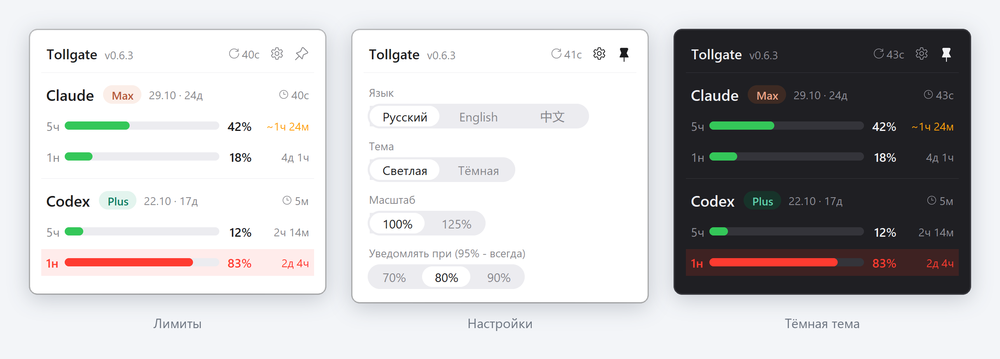

<p align="center">
  
</p>

<h1 align="center">Tollgate</h1>

<p align="center">
  <a href="README.md"></a>
  <a href="README.ru.md"></a>
</p>

<p align="center"><em>«Лимит кончается в самый неподходящий момент - посреди задачи. Tollgate держит его на виду: шлагбаум между тобой и ИИ, который показывает, сколько потрачено, и предупреждает заранее. А дальше научится экономить токены и не пропускать секреты.»</em></p>

<p align="center">
  <a href="CHANGELOG.md"></a>
  <a href="https://github.com/sergvss/tollgate/actions/workflows/tests.yml"></a>
  <a href="LICENSE"></a>
  
  
  
  
  
</p>

<p align="center">
  <a href="#зачем">Зачем</a> ·
  <a href="#быстрый-старт">Быстрый старт</a> ·
  <a href="#что-умеет">Что умеет</a> ·
  <a href="#управление">Управление</a> ·
  <a href="#откуда-данные">Откуда данные</a> ·
  <a href="#чего-tollgate-не-делает">Чего не делает</a> ·
  <a href="#обновление-и-удаление">Обновление</a> ·
  <a href="#ограничения">Ограничения</a> ·
  <a href="#планы">Планы</a> ·
  <a href="#разработка">Разработка</a>
</p>

---

Иконка в трее Windows (рядом с часами) и всплывающая панель с лимитами подписок **Claude Code** и **Codex** (ChatGPT): сколько израсходовано в каждом окне (5 часов, день, неделя), когда сброс, тариф и срок подписки. Когда лимит подходит к концу, Tollgate присылает уведомление и подсвечивает окно, которое заканчивается, а при быстром расходе заранее показывает, через сколько лимит кончится.

<p align="center">
  
</p>

---

## Зачем

| Ситуация | Что даёт Tollgate |
|---|---|
| 5-часовой лимит Claude кончился посреди задачи, без предупреждения | Плашка-уведомление в одну строку на выбранном пороге (70/80/90%) и всегда на 95% - видна даже в режиме «Не беспокоить»; прогноз «при текущем темпе кончится через ~40м» |
| Работаете и в Claude Code, и в Codex - непонятно, где ещё есть запас | Оба провайдера в одной панели, все окна лимитов: 5ч, 1д, 1н |
| Работаете в десктоп-приложении или IDE, а лимиты в статус-строке не обновляются | Автообновление раз в 5 минут, где бы вы ни работали |
| Забыли, когда продлевается подписка | Плашка тарифа, дата окончания и сколько дней осталось; напоминание за 3 дня |
| Не хочется ставить утилиту, которая отправляет данные или читает токены | Только локальные файлы; токены входа не читаются |

---

## Быстрый старт

| | Что сделать |
|---|---|
| 1 | Поставить Windows 10/11 и [Python 3.10+](https://www.python.org/downloads/) - при установке отметить **Add python.exe to PATH** |
| 2 | `git clone https://github.com/sergvss/tollgate.git` |
| 3 | `cd tollgate` и запустить `install.bat` |
| 4 | Найти у часов иконку с двумя полосками и кликнуть по ней левой кнопкой |
| 5 | Проверка без окна: `python -X utf8 tollgate.py --print` - должны напечататься лимиты обоих провайдеров |

Если иконку не видно - она под стрелкой «^» в трее: перетащить на панель задач или включить в «Параметры → Персонализация → Панель задач → Другие значки».

**Что делает `install.bat`:**

1. Ставит зависимости (`pystray`, `pillow`).
2. Прописывает статус-строку Claude Code (`statusline.py`) в `~/.claude/settings.json` - в терминале лимиты Claude обновляются после каждого ответа. Если у вас уже есть своя статус-строка, она не трогается. Перед правкой сохраняется бэкап `settings.json.bak-tollgate`.
3. Кладёт ярлык `Tollgate.lnk` в автозагрузку и запускает виджет. Повторный запуск не создаёт второй экземпляр.

---

## Что умеет

- **Лимиты двух провайдеров** - Claude Code (5ч, неделя) и Codex (окна подписки ChatGPT): процент, полоска, время до сброса и возраст данных.
- **Прогноз** - если при текущем темпе лимит кончится раньше сброса, вместо времени сброса жёлтым показано, через сколько он кончится (`~40м`). Темп - по последнему часу работы.
- **Уведомления** - на выбранном пороге (70%, 80% или 90%, по умолчанию 80%) и всегда на 95% в правом нижнем углу появляется плашка в одну строку в стиле панели: провайдер, окно, полоска, процент, время до сброса. Это собственное окно Tollgate, а не уведомление Windows, поэтому оно видно и в режиме «Не беспокоить». Фокус не забирает и висит, пока не закроете (×); когда окно лимита сбросится, уходит само. Несколько плашек встают стопкой. В панели заканчивающиеся окна подсвечиваются.
- **Подписка** - тариф, дата окончания и сколько дней осталось. За 3 дня до конца срок желтеет и появляется плашка-напоминание, после - краснеет. У Codex дата точная, у Claude - оценка (месячное продление от даты оформления).
- **Автообновление** - раз в 5 минут, где бы вы ни работали: терминал, десктоп-приложение, IDE.
- **Настройки** - язык (русский, English, 中文), тема (светлая, тёмная), масштаб (100%, 125%), порог уведомлений. Всё сохраняется; язык действует и на статус-строку Claude Code.
- **Пин** - закреплённая панель всегда на экране и остаётся после перезапуска.

---

## Управление

| Действие | Результат |
|---|---|
| Левый клик по иконке | Показать/скрыть панель (справа снизу) |
| Клик по плашке-уведомлению | Открыть панель (плашки закроются) |
| × на плашке | Закрыть её - вернётся только на следующем пороге |
| Наведение на иконку | Подсказка с цифрами по всем окнам |
| Правый клик по иконке | Версия, Показать, Обновить, Выход |
| Клик мимо панели или Esc | Спрятать (если панель не закреплена) |
| Стрелка в шапке | Обновить сейчас; рядом - возраст самых свежих данных: 12с, 3м, 2ч, 1д |
| Шестерёнка | Настройки в том же окне |
| Пин | Закрепить панель |

Иконка в трее - две полоски, Claude и Codex: показывают самое короткое окно (5ч) - оно решает, можно ли работать прямо сейчас; цвет зелёный / жёлтый / красный. Если более длинное окно почти исчерпано (от 95%), полоска показывает его. В подсказке при наведении - все окна. Данные перечитываются раз в 30 секунд.

---

## Откуда данные

| Что | Claude | Codex |
|---|---|---|
| Лимиты | кэш `~/.claude.json` → `cachedUsageUtilization` (обновляет `claude -p /usage` раз в 5 минут) или `~/.tollgate/claude-usage.json` (пишет `statusline.py` после каждого ответа в терминале) - что свежее | `~/.tollgate/codex-usage.json` (ответ Codex на `account/rateLimits/read`, раз в 5 минут) или последний `~/.codex/sessions/**/*.jsonl` → событие `rate_limits` - что свежее |
| Тариф | `~/.claude.json` → `oauthAccount.organizationType` | `~/.codex/auth.json` → `id_token` → `chatgpt_plan_type` |
| Срок подписки | оценка: месячное продление от `oauthAccount.subscriptionCreatedAt` (дата окончания локально не хранится) | точно: `chatgpt_subscription_active_until` |

**Как обновляются лимиты Claude.** Десктоп-приложение и IDE не вызывают статус-строку, а свой кэш Claude Code обновляет редко. Поэтому раз в 5 минут (и по стрелке в шапке) Tollgate в фоне запускает `claude -p /usage`. Запрос лимитов к Anthropic делает сам Claude Code - тот же, что он делает и без Tollgate. К модели запрос не идёт и лимит не тратит.

**Как обновляются лимиты Codex.** Codex пишет лимиты в логи сессий, только пока вы работаете с ним на этом компьютере, а лимит общий с облаком Codex, ChatGPT и другими компьютерами. Поэтому раз в 5 минут Tollgate спрашивает и Codex напрямую: запускает в фоне `codex app-server` и вызывает `account/rateLimits/read`. Запрос тоже делает сам Codex, к модели он не идёт, токены Tollgate не читает.

Для прогноза Tollgate хранит замеры лимитов за 7 дней в `~/.tollgate/history.jsonl` - только проценты и время.

---

## Чего Tollgate не делает

- **Не отправляет ваши данные.** Сам Tollgate в сеть не ходит. Сетевые запросы - только чтение лимитов: `claude -p /usage` и `account/rateLimits/read` у Codex, и делают их сами Claude Code и Codex.
- **Не читает токены входа.** Из `~/.codex/auth.json` декодируется только открытая часть `id_token` (поля про подписку), сами токены не используются и никуда не передаются. `~/.claude/.credentials.json` не читается вовсе.
- **Не хранит тексты запросов.** В истории - только проценты и время.
- **Не перетирает чужие настройки.** Статус-строка ставится, только если у вас нет своей; перед любой правкой `settings.json` - бэкап.

---

## Обновление и удаление

**Обновить:** «Выход» в меню иконки, затем в папке проекта `git pull` и `install.bat` - он поставит новые зависимости и запустит виджет.

**Удалить:** `uninstall.bat` - останавливает виджет, убирает ярлык из автозагрузки и статус-строку Tollgate из `~/.claude/settings.json`. Чужую статус-строку и остальные настройки не трогает, перед правкой сохраняет бэкап `settings.json.bak-tollgate-uninstall`. Папку `~/.tollgate` (настройки и история) и папку проекта после этого можно удалить вручную.

---

## Ограничения

- Только Windows 10/11.
- Для свежих лимитов Codex нужен `codex` в `PATH` (так ставит официальный установщик). Без него данные Codex берутся только из логов сессий, а их Codex пишет, только пока вы работаете с ним на этом компьютере.
- Для автообновления лимитов Claude нужен `claude` в `PATH` (так ставит официальный установщик). Без него данные Claude обновляются только статус-строкой в терминале и редким кэшем Claude Code.
- Если окно лимита уже сбросилось, а новых данных нет, показывается 0% и «сброшен».

---

## Планы

| | Эпик | Что даст |
|---|---|---|
| ✅ | Мониторинг и уведомления | Лимиты, прогноз, пороги, срок подписки |
| ⏳ | Экономия токенов | Что сжигает лимит: расход по проектам и сессиям, отслеживание выбранной папки, доля кэша, «дорогие» действия, подсказки по ходу работы |
| ⏳ | Классификация запросов | На что уходят запросы - без хранения их текста |
| ⏳ | Шлагбаум для секретов | Хук, который не пускает в модель ключи, пароли и персональные данные |
| ⏳ | Дистрибуция | Сборка `.exe` и GitHub Releases - ставить без Python |
| ⏳ | API-ключи и другие платформы | Аккаунт OpenRouter и его ключи или отдельный ключ на выбранной платформе: расход, лимит, остаток (по явному включению, ключ хранится зашифрованным) |
| ⏳ | Отчёты | Сводка расхода за день или неделю - в свой GitHub-репозиторий, на почту или webhook; только цифры, по явному включению |

Подробно, с критериями готовности - [TODO.md](TODO.md). История версий - [CHANGELOG.md](CHANGELOG.md).

---

## Разработка

```
tollgate.py         всё приложение: чтение данных, иконка в трее, панель (tkinter + pystray + Pillow)
statusline.py       статус-строка Claude Code: свежие лимиты после каждого ответа в терминале
install.bat         зависимости, статус-строка, автозапуск, запуск
uninstall.bat       удаление: остановить виджет, убрать автозапуск и статус-строку Tollgate
tests/              pytest: форматы Claude и Codex, история и прогноз, статус-строка, автообновление
.github/workflows/  тесты на каждый push: Windows, Python 3.10 и 3.13

PROJECT_MAP.md      архитектура, принятые решения и пройденные грабли
AGENTS.md           правила для ИИ-ассистентов, работающих с репозиторием
TODO.md             план по эпикам с критериями готовности
CHANGELOG.md        история версий
```

```
python -m pip install -r requirements.txt pytest
python -m pytest -q                    # тесты
python -X utf8 tollgate.py --print     # данные в консоль, без окна
```

Перед правками интерфейса прочитайте [PROJECT_MAP.md](PROJECT_MAP.md): там описано, почему панель обновляется на месте, как подменяются экраны и какие подходы уже пробовали и отвергли.

---

## Лицензия

MIT - см. [`LICENSE`](LICENSE).

---

<p align="center"><em>Если Tollgate вовремя предупредил о лимите - звезда на GitHub поможет другим его найти. Issues и PR приветствуются.</em></p>
